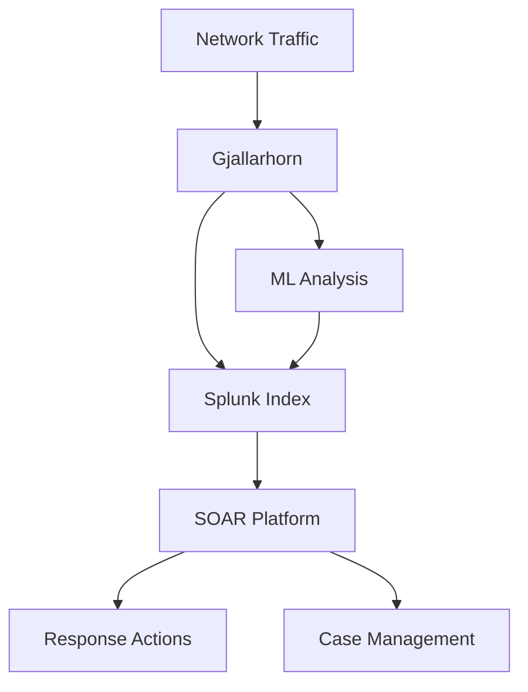

# Gjallarhorn Integration Documentation

## 1. Splunk Integration Workflows

### 1.1 Data Ingestion Workflow
```splunk
# Index Configuration
[gjallarhorn]
homePath = $SPLUNK_DB/gjallarhorn/db
coldPath = $SPLUNK_DB/gjallarhorn/colddb
thawedPath = $SPLUNK_DB/gjallarhorn/thaweddb

# Data Input Configuration
[monitor:///path/to/gjallarhorn/logs/*.log]
sourcetype = gjallarhorn_ml
index = gjallarhorn
```

### 1.2 Search Queries

#### Anomaly Detection Search
```splunk
index=gjallarhorn sourcetype=gjallarhorn_ml 
| eval risk_level=case(
    anomaly_score >= 0.8, "Critical",
    anomaly_score >= 0.6, "High",
    anomaly_score >= 0.4, "Medium",
    1=1, "Low"
)
| stats count by risk_level, source_ip, dest_ip
```

#### UHG Space Analysis
```splunk
index=gjallarhorn sourcetype=gjallarhorn_ml 
| eval uhg_distance=sqrt(pow(x_coord,2) + pow(y_coord,2))
| where uhg_distance > threshold
| table _time source_ip dest_ip uhg_distance anomaly_score
```

### 1.3 Dashboards

#### Main Monitoring Dashboard
- Anomaly Score Distribution
- Top Risky IPs
- UHG Space Visualization
- Temporal Pattern Analysis

#### Investigation Dashboard
- Detailed Event Analysis
- Historical Context
- Related Events Timeline
- Risk Factor Breakdown

## 2. SOAR Integration Workflows

### 2.1 Anomaly Detection Workflow
```yaml
name: Gjallarhorn Anomaly Detection
trigger:
  - source: splunk
    query: 'index=gjallarhorn anomaly_score>0.8'
actions:
  - analyze_event:
      input: ${event}
      model: gjallarhorn_uhg
  - enrich_data:
      ip: ${event.source_ip}
  - create_alert:
      severity: ${event.risk_level}
      details: ${analysis_results}
```

### 2.2 Investigation Workflow
```yaml
name: Gjallarhorn Investigation
trigger:
  - source: alert
    type: gjallarhorn_anomaly
actions:
  - gather_context:
      timerange: -1h to now
      related_ips: ${alert.source_ip}
  - analyze_behavior:
      model: gjallarhorn_behavioral
      data: ${context}
  - create_case:
      title: "Gjallarhorn Alert: ${alert.id}"
      severity: ${alert.severity}
      evidence: ${investigation_results}
```

### 2.3 Response Workflow
```yaml
name: Gjallarhorn Response
trigger:
  - source: case
    type: gjallarhorn_incident
conditions:
  - severity: High OR Critical
actions:
  - block_ip:
      ip: ${case.source_ip}
      duration: 24h
  - isolate_host:
      hostname: ${case.affected_host}
  - notify_team:
      team: soc
      priority: high
```

## 3. Component-Specific Workflows

### 3.1 UHG Space Analysis
```yaml
name: UHG Space Analysis
trigger:
  - schedule: every 5 minutes
actions:
  - analyze_uhg:
      input: ${recent_events}
      model: gjallarhorn_uhg
  - detect_clusters:
      space: uhg
      method: dbscan
  - alert_anomalies:
      threshold: 0.8
      cluster_distance: 2.0
```

### 3.2 Behavioral Analysis
```yaml
name: Behavioral Pattern Analysis
trigger:
  - schedule: every 15 minutes
actions:
  - analyze_patterns:
      timeframe: -1h
      features: [packet_length, protocol, port]
  - detect_deviations:
      baseline: ${historical_patterns}
      threshold: 2.5
  - update_model:
      condition: ${deviation_score} < 0.3
```

### 3.3 Risk Assessment
```yaml
name: Risk Assessment
trigger:
  - event: new_analysis_result
actions:
  - calculate_risk:
      factors:
        - uhg_distance
        - behavioral_deviation
        - historical_incidents
  - project_risk:
      timeframes: [short_term, medium_term, long_term]
  - update_dashboard:
      panels: [risk_heatmap, projection_graph]
```

## 4. Integration Points

### 4.1 Data Flow


### 4.2 API Endpoints
```yaml
- /api/v1/analyze:
    method: POST
    payload: network_event
    response: analysis_results

- /api/v1/enrich:
    method: POST
    payload: event_data
    response: enrichment_data

- /api/v1/risk:
    method: GET
    params: [source_ip, timeframe]
    response: risk_assessment
```

### 4.3 Configuration Requirements
```yaml
splunk:
  index: gjallarhorn
  sourcetype: gjallarhorn_ml
  retention: 90d

soar:
  playbooks: [anomaly, investigation, response]
  integrations:
    - firewall
    - edr
    - ticketing
    - notification

ml_models:
  - uhg_space
  - behavioral
  - risk_projection
``` 